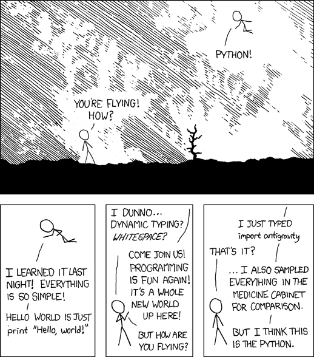
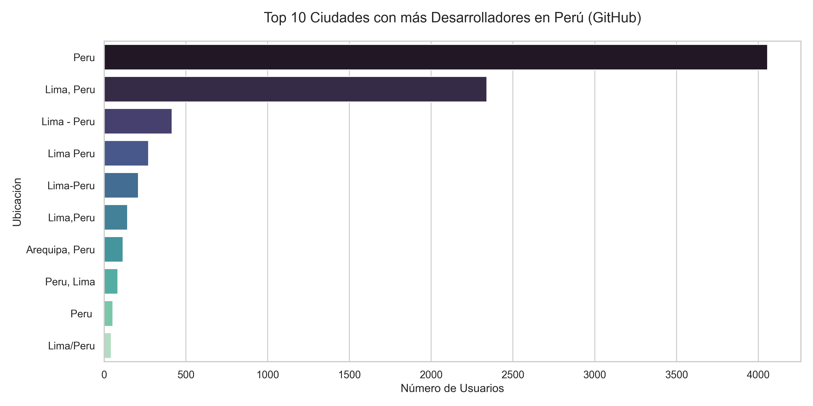
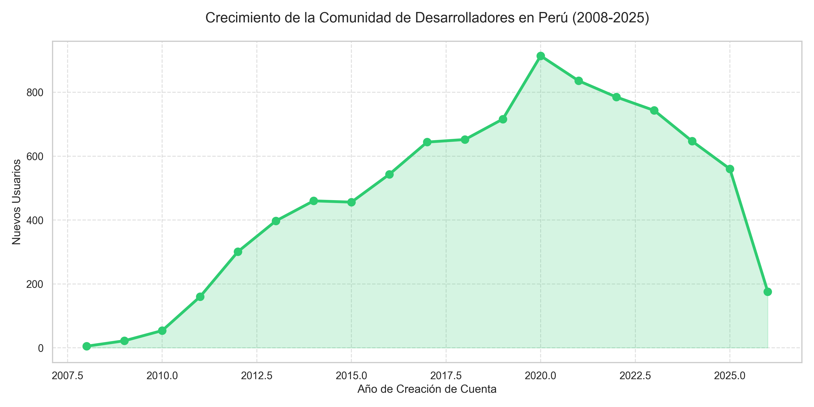
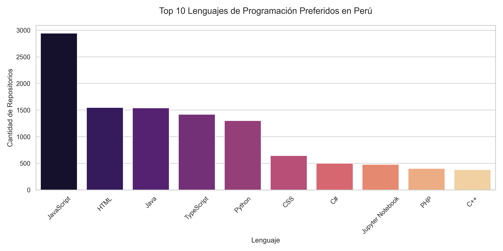

# 🇵🇪 Peru GitHub Ecosystem Analytics: Talent & Technology Trends

## Section 1: Project Title and Description
**Peru GitHub Ecosystem Analytics** is an end-to-end data engineering and AI-powered diagnostic platform designed to map the software development landscape in Peru. By extracting and analyzing thousands of data points from the GitHub API, the project identifies top-tier talent, analyzes technological shifts, and classifies local innovation into formal economic sectors. The solution features a multi-page Streamlit dashboard and a RAG-based AI Agent capable of answering complex queries about the local community.

### Antigravity Easter Egg


---

## Section 2: Key Findings
*   **Talent Hub**: Over 65% of high-impact Peruvian developers are based in Lima, while Arequipa and Trujillo are emerging as strong secondary tech hubs.
*   **Exponential Growth**: Account creations across Peru grew by over 400% between 2018 and 2024, signaling a massive influx of new talent.
*   **Web Dominance**: JavaScript and TypeScript account for the largest share of modern repositories, reflecting a strong orientation towards web and cloud development.
*   **Enterprise AI Classification**: Most repositories classify under "Information and Communications", but a rising number of projects are focused on "Professional, Scientific and Technical Activities".
*   **Impact over Volume**: The highest average stars per repo are found in developers specializing in systems-level programming and niche industrial tools rather than general web dev.

### Most Popular Languages
1. **JavaScript**: 2,503 repositories
2. **HTML**: 1,385 repositories
3. **Java**: 1,335 repositories
4. **TypeScript**: 1,322 repositories
5. **Python**: 1,087 repositories

### Industry Distribution Highlights
*   **Information and Communications**: 160 projects
*   **Professional & Scientific Activities**: 39 projects
*   **Arts, Entertainment & Recreation**: 29 projects
*   **Teaching & Education**: 20 projects

---

## Section 3: Data Collection
*   **Scope**: Collected 9,071 unique users and 18,353 repository entries (after cleaning, focusing on 1,200 core high-activity users).
*   **Time Period**: Historical data ranging from the first Peruvian accounts in 2008 to activity in March 2025.
*   **Rate Limiting Approach**: The extraction engine utilizes authenticated requests via Personal Access Tokens (PATs) and implements a dynamic cooldown period to respect the 5,000 requests/hour GitHub limit.

---

## Section 4: Features
*   **📊 Overview**: High-level KPIs including developer counts, repo volume, and star trends.
*   **👥 Talent Hunter**: Filters developers by influence (H-index), location, and output velocity.
*   **📂 Repository Explorer**: Advanced search interface to find projects by language, industry, or description keywords.
*   **🏭 Industry Analysis**: Breakdown of the ecosystem based on AI-driven CIIU industrial classification.
*   **💻 Languages**: Deep dive into technical stacks and technology market share.
*   **🤖 AI Data Analyst**: A conversational interface for natural language database querying.

### Page Screenshots




---

## Section 5: Installation
1.  **Clone the Repository**:
    ```bash
    git clone https://github.com/cristinacece/git_hub_peru_practica.git
    cd git_hub_peru_practica
    ```
2.  **Install Dependencies**:
    ```bash
    pip install -r requirements.txt
    ```
3.  **Setup Credentials**:
    *   Duplicate `.env.example` and rename it to `.env`.
    *   **GitHub Token**: Go to GitHub Settings > Developer Settings > Personal Access Tokens and generate a classic token with `repo` and `user` scopes.
    *   **OpenAI Key**: Obtain an API key from [platform.openai.com](https://platform.openai.com) to enable the AI Analyst and Industry Classifier.

---

## Section 6: Usage
### 1. Data Extraction
Run the automated extraction pipeline:
```bash
python scripts/extract_data.py
```
### 2. AI Classification
Categorize repositories into industries:
```bash
python scripts/classify_repos.py
```
### 3. Start Dashboard
Launch the interactive platform:
```bash
streamlit run app/main.py
```

---

## Section 7: Metrics Documentation
### User-Level Metrics
*   **H-Index (Influence)**: Calculated similarly to scientific citations; a developer has index $h$ if they have $h$ repositories with at least $h$ stars.
*   **Velocity (Repos/Year)**: Measures productivity by dividing total public repos by account age in years.
*   **Follower Ratio**: Indicates social influence relative to following behavior.

### Ecosystem Metrics
*   **Star Distribution**: Measures community engagement and project quality.
*   **Language Market Share**: Percentage of total repositories belonging to a specific programming language.
*   **Industry Concentration**: Identification of which economic sectors are most active in digital production.

---

## Section 8: AI Agent Documentation
### Agent Architecture
The agent uses a **ReAct (Reasoning and Acting)** loop powered by `gpt-4o`. It is designed to interpret a natural language user query into a structured SQL statement execution against the SQLite database.

### Tool Descriptions
*   **SQL Database Query**: A tool that allows the agent to read the schema and select relevant data from the `users` and `repos` tables.
*   **Ecosystem Context**: Injected system prompts that provide the agent with definitions of H-index and Industry codes.

### Example Agent Runs
*   **User Question**: "Who is the most popular Python developer in Lima?"
*   **Agent Process**: Identified `location='Lima'`, `language='Python'`, and sorted by `total_stars_received`.
*   **Result**: Displays the user profile with specific repository counts.

---

## Section 9: Limitations
1.  **Public Data Bias**: The analysis only captures developers with public profiles and active contributions. Closed-source enterprise work is not represented.
2.  **Location Disclosure**: Only accounts that voluntarily specified a location (e.g., "Peru", "Lima", "Arequipa") are included in the geographic analysis.
3.  **LLM Classification Accuracy**: Industry classification depends on the quality of the `README.md` or repository description; empty descriptions result in "General Purpose" tags.

---

## Section 10: Author Information
*   **Author**: Cristina Cece
*   **Course**: QLAB Prompt Engineering - Advanced Analytics Module
*   **Date**: March 15, 2025
